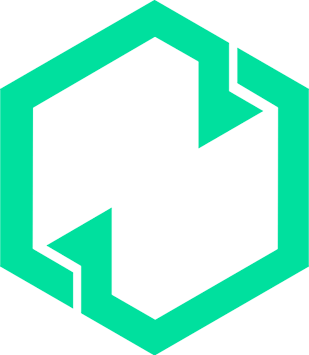

# FZ Academy - Curso de P2P

<div align="center">
  
  
  **Educación de calidad a precio justo • Resultados reales garantizados**
  
  Landing page de ventas para curso de trading P2P que transforma tu vida financiera.
</div>

## 📋 Tabla de Contenidos

- [Descripción del Proyecto](#-descripción-del-proyecto)
- [Características Principales](#-características-principales)
- [Tecnologías Utilizadas](#-tecnologías-utilizadas)
- [Arquitectura del Proyecto](#-arquitectura-del-proyecto)
- [Instalación y Configuración](#-instalación-y-configuración)
- [Estructura del Proyecto](#-estructura-del-proyecto)
- [Componentes](#-componentes)
- [Secciones de la Landing](#-secciones-de-la-landing)
- [Diseño y UX](#-diseño-y-ux)
- [Desarrollo](#-desarrollo)
- [Deployment](#-deployment)

## 🚀 Descripción del Proyecto

Landing page diseñada como embudo de ventas para un curso de trading P2P. El objetivo es persuadir a visitantes para que compren el curso mostrando:
- **Tu historia personal** de emigrante venezolano en Estados Unidos
- **El problema** de trabajar 15 horas diarias en trabajos físicos
- **La solución** generando $100+ diarios desde casa
- **Testimonios** de estudiantes exitosos
- **Contenido del curso** y lo que incluye
- **Call to action** con urgencia y precio especial

### Objetivos del Proyecto

- **Generar ventas** del curso a través de un embudo de conversión efectivo
- **Crear confianza** mediante testimonio personal y prueba social
- **Persuadir** con el contraste antes/después
- **Convertir visitantes** en estudiantes

## ✨ Características Principales

### 🎯 Embudo de Conversión

- **Sección de Video**: Testimonio personal en video explicando tu historia
- **Problema vs Solución**: Comparación visual del antes y después
- **Testimonios**: Casos de éxito de estudiantes reales
- **Contenido del Curso**: Qué incluye y por qué vale $97
- **Call to Action**: Botón de compra con urgencia y oferta limitada

### 💼 Historia del Emprendedor

La landing cuenta la historia real de un emigrante venezolano que:
- Trabajó 15 horas al día en múltiples trabajos (construcción, delivery, limpieza, taxista, pintor)
- Recibía un sueldo mensual muy bajo
- Descubrió el trading P2P y ahora genera $100+ diarios
- Gana más trabajando menos horas desde casa

### 📈 Elementos de Persuasión

- **Urgencia**: Timer que muestra tiempo limitado para el precio especial
- **Escasez**: Precio original tachado ($297) vs precio de lanzamiento ($97)
- **Garantía**: Devolución de dinero en 30 días
- **Prueba social**: Testimonios verificados con 5 estrellas

## 🛠 Tecnologías Utilizadas

### Frontend
- **React 18** - Biblioteca de interfaz de usuario
- **TypeScript** - Tipado estático para JavaScript
- **Vite** - Herramienta de construcción rápida
- **CSS Modules** - Estilos modulares y encapsulados
- **Framer Motion** - Animaciones fluidas y transiciones

### Desarrollo
- **ESLint** - Linting y análisis de código
- **Prettier** - Formateo automático de código
- **Git** - Control de versiones

### Diseño
- **CSS Grid & Flexbox** - Layouts responsivos
- **CSS Animations** - Transiciones y efectos
- **Gradientes CSS** - Efectos visuales con paleta verde
- **Media Queries** - Diseño responsivo

## 🏗 Arquitectura del Proyecto

El proyecto sigue el **patrón de diseño atómico** (Atomic Design), organizando los componentes en una jerarquía clara y escalable:

```
src/
├── components/
│   ├── atoms/          # Componentes básicos (Logo, PrimaryButton, Icons)
│   ├── molecules/      # Componentes compuestos (FeatureItem, TestimonialCard, etc.)
│   ├── organisms/      # Secciones completas (VideoSection, ProblemSolution, etc.)
│   └── templates/      # Layouts y estructuras (PageTemplate)
├── data/               # Datos estáticos (appData.ts)
├── assets/             # Recursos estáticos (imágenes, videos)
├── layouts/            # Layouts principales (PublicLayout)
├── pages/              # Páginas (LandingPage)
└── context/            # Context API (WalletContext)
```

### Principios de Diseño

- **Atomic Design**: Componentes organizados por complejidad
- **Responsive Design**: Adaptable a todos los dispositivos
- **Mobile First**: Diseño optimizado para móviles
- **Performance**: Carga rápida y optimizada
- **SEO Friendly**: Optimizado para motores de búsqueda

## 🚀 Instalación y Configuración

### Prerrequisitos

- Node.js (versión 18 o superior)
- npm o yarn
- Git

### Pasos de Instalación

1. **Clonar el repositorio**
   ```bash
   git clone https://github.com/tu-usuario/fz-academy.git
   cd fz-academy
   ```

2. **Instalar dependencias**
   ```bash
   npm install
   ```

3. **Ejecutar en modo desarrollo**
   ```bash
   npm run dev
   ```

4. **Abrir en el navegador**
   ```
   http://localhost:5173
   ```

### Scripts Disponibles

```bash
# Desarrollo
npm run dev          # Servidor de desarrollo
npm run build        # Construcción para producción
npm run preview      # Vista previa de la construcción
npm run lint         # Análisis de código
```

## 📁 Estructura del Proyecto

```
fz-academy/
├── public/
│   └── favicon.png
├── src/
│   ├── assets/
│   │   └── images/          # Imágenes y recursos visuales
│   ├── components/
│   │   ├── atoms/           # Componentes básicos
│   │   │   ├── Logo/
│   │   │   ├── PrimaryButton/
│   │   │   └── icons/
│   │   ├── molecules/       # Componentes compuestos
│   │   │   ├── FeatureItem/
│   │   │   ├── TestimonialCard/
│   │   │   ├── UrgencyTimer/
│   │   │   ├── SocialIconsGroup/
│   │   │   └── NavLinkItem/
│   │   ├── organisms/       # Secciones completas
│   │   │   ├── VideoSection/
│   │   │   ├── ProblemSolutionSection/
│   │   │   ├── TestimonialsSection/
│   │   │   ├── CourseInclusionsSection/
│   │   │   ├── CTAUrgencySection/
│   │   │   ├── Header/
│   │   │   └── Footer/
│   │   └── templates/
│   │       └── PageTemplate/
│   ├── data/
│   │   └── appData.ts       # Datos de la aplicación
│   ├── layouts/
│   │   └── PublicLayout.tsx
│   ├── pages/
│   │   └── LandingPage.tsx
│   ├── App.tsx
│   ├── main.tsx
│   └── index.css
├── index.html
├── package.json
├── vite.config.ts
└── README.md
```

## 🧩 Componentes

### Átomos (Atoms)
Componentes básicos e indivisibles:

- **`Logo`** - Logo de la academia
- **`PrimaryButton`** - Botón principal de acción
- **`TelegramIcon`** - Icono de Telegram
- **`TwitterIcon`** - Icono de Twitter

### Moléculas (Molecules)
Combinaciones de átomos:

- **`FeatureItem`** - Card de característica individual
- **`TestimonialCard`** - Card de testimonio con estrellas
- **`UrgencyTimer`** - Timer para crear urgencia
- **`SocialIconsGroup`** - Grupo de iconos sociales
- **`NavLinkItem`** - Item de navegación

### Organismos (Organisms)
Secciones completas de la interfaz:

- **`VideoSection`** - Video testimonial personal
- **`ProblemSolutionSection`** - Comparación antes/después
- **`TestimonialsSection`** - Grid de testimonios
- **`CourseInclusionsSection`** - Qué incluye el curso
- **`CTAUrgencySection`** - Llamado a acción final
- **`Header`** - Navegación principal con menú móvil
- **`Footer`** - Pie de página con redes sociales

## 🎯 Secciones de la Landing

### 1. VideoSection
- **Video testimonial** explicando tu historia
- **3 puntos clave**: Antes, Ahora, El Curso
- **Animaciones** con Framer Motion

### 2. ProblemSolutionSection
- **Comparación lado a lado**: Problema vs Solución
- **4 características** de cada lado
- **Badges de colores**: Rojo (problema) y Verde (solución)

### 3. TestimonialsSection
- **3 testimonios** de estudiantes exitosos
- **5 estrellas** en cada card
- **Cards responsivos** que se adaptan

### 4. CourseInclusionsSection
- **6 elementos** del curso con íconos
- **Grid responsivo** que se adapta
- **Hover effects** en cada card

### 5. CTAUrgencySection
- **Timer de urgencia**
- **Precio tachado** ($297 → $97)
- **Botón de compra** destacado
- **Garantía** de 30 días

## 🎨 Diseño y UX

### Sistema de Colores
- **Paleta Verde**: 
  - Verde claro: `#C9FBD6` (#5DE89C)
  - Verde medio: `#00CD82`
  - Verde oscuro: `#005256`
  - Verde muy oscuro: `#003538`, `#021a20`, `#011318`
- **Fondo**: Oscuro con gradientes
- **Texto**: Blanco (#ffffff) y grises

### Tipografía
- **Títulos**: Gradientes de abajo hacia arriba con tonos verdes
- **Texto**: Fuentes legibles y responsivas
- **Jerarquía**: Claramente definida

### Animaciones
- **Scroll suave**: Navegación fluida entre secciones
- **Stagger animations**: Elementos aparecen secuencialmente
- **Hover effects**: Interacciones visuales en cards
- **Framer Motion**: Animaciones profesionales

### Responsive Design
- **Mobile First**: Diseño optimizado para móviles
- **Breakpoints**: Adaptación automática
- **Touch friendly**: Interfaz táctil optimizada

## 💻 Desarrollo

### Convenciones de Código

- **TypeScript**: Tipado estricto
- **ESLint**: Reglas de código consistentes
- **CSS Modules**: Estilos encapsulados
- **Atomic Design**: Organización clara de componentes

### Estructura de Componentes

```typescript
// Ejemplo de estructura de organismo
interface SectionProps {
  title: string;
  subtitle: string;
  data: Array<ItemData>;
}

const Section: React.FC<SectionProps> = ({ title, subtitle, data }) => {
  return (
    <section>
      <h2>{title}</h2>
      <p>{subtitle}</p>
      {/* Contenido */}
    </section>
  );
};

export default Section;
```

## 🚀 Deployment

### Construcción para Producción

```bash
npm run build
```

### Deployment en Netlify

1. Conectar repositorio de GitHub
2. Configurar build command: `npm run build`
3. Publish directory: `dist`
4. Variables de entorno si es necesario

### Optimizaciones Incluidas

- **Tree shaking**: Eliminación de código no utilizado
- **Code splitting**: División automática de código
- **Asset optimization**: Imágenes optimizadas
- **Minification**: Código comprimido

## 📊 Métricas de Conversión

El embudo está diseñado para:
1. **Captar atención** con video testimonial
2. **Identificar problema** con comparación visual
3. **Generar confianza** con testimonios
4. **Mostrar valor** con contenido del curso
5. **Convertir** con CTA con urgencia

---

<div align="center">
  <p>Hecho con ❤️ por FZ Academy</p>
  <p>© 2025. Todos los derechos reservados.</p>
  <p>Educación de calidad a precio justo</p>
</div>
